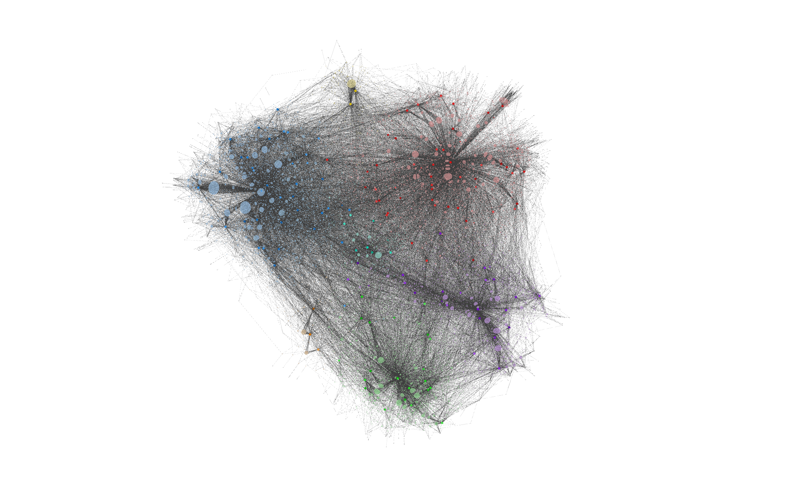

# PaperBrain — Psych

A two-tier research environment for the **entire OpenAlex Psychology corpus**
(~6.6M papers). It pairs a **curated, navigable Obsidian vault** of ~20k
stratified papers with a **local SQLite backend** of the full 6.6M, stitched
together by an Obsidian plugin that turns the sidebar into a live query
surface over the whole field.



*Obsidian graph view: the 20 k stratified papers + 4.2 k topic nodes, colored by subfield. Larger nodes are higher-citation topics.*

> ⚠️ **This is a single-subject build (Psychology).** Repo name: [`s1lentblade/Paperbrain-Psych`](https://github.com/s1lentblade/Paperbrain-Psych).
> It is *not* a generic/pluggable framework — the generators, the subfield
> layout, and the graph palette are all tuned for OpenAlex field `32`
> (Psychology). Adapting to another field is a fork, not a config change.

## Architecture

```
 ┌─────────────────────────────────────────────────────────────────┐
 │  OpenAlex (primary_topic.field.id = fields/32, ~6.6M works)     │
 └──────────────┬──────────────────────────────────────────────────┘
                │  fetch_papers.py  (annual + sub-year partitions,
                │                    key-rotating polite cursor pull)
                ▼
 ┌─────────────────────────────────────────────────────────────────┐
 │  data/by_year/*.jsonl              ~29 GB  (raw OpenAlex dump)  │
 └──────────────┬──────────────────────────────────────────────────┘
                │  build_db.py  (FTS5, topic/paper joins, indexes)
                ▼
 ┌─────────────────────────────────────────────────────────────────┐
 │  data/papers.db                    ~20 GB  SQLite + FTS5        │
 └──────────────┬─────────────────────────────┬────────────────────┘
                │                             │
         ┌──────┘                             └──────┐
         ▼                                           ▼
 ┌──────────────────────┐                 ┌──────────────────────────┐
 │  Tier 1 — VAULT      │                 │  Tier 2 — BACKEND        │
 │                      │                 │                          │
 │  generate_vault.py   │                 │  db_server.py            │
 │  generate_papers.py  │                 │  localhost:27182         │
 │  generate_graphs.py  │                 │  /search /topic /paper   │
 │                      │                 │  /bridges /health        │
 │  ~20 k stratified    │                 │                          │
 │  markdown notes      │                 │  queried by Obsidian     │
 │  Maps · Topics ·     │ ◀──plugin──────▶│  plugin "PaperBrain"     │
 │  Papers · Graphs     │                 │  (sidebar search, top-   │
 │                      │                 │   cited lists, related,  │
 │                      │                 │   topic deep-dives)      │
 └──────────────────────┘                 └──────────────────────────┘
```

The vault is what you *read*. The backend is what you *reach into* when the
vault isn't enough — every one of the 6.6M papers is one sidebar click away,
searchable by FTS, filterable by topic or year, sortable by citations.

## What's in the vault

Browse [`full psychology breakdown/`](./full%20psychology%20breakdown) directly, or open it in Obsidian.

| Folder | Contents |
|---|---|
| `Maps/` | One MOC per psychology subfield (Clinical, Social, Cognitive, Developmental, Applied, Neuropsychology, General) plus a top-level Psychology Overview and an Analytics map |
| `Topics/` | 4,219 topic notes (OpenAlex primary topics) — 144 core psychology topics plus cross-disciplinary neighbours that showed up as primary topics in the stratified sample |
| `Papers/` | 20,000 paper notes — frontmatter (authors, year, DOI, citations, subfield, topics, OpenAlex ID) + abstract + back-links to every topic it touches |
| `Graphs/` | 8 analytical PNGs: topic emergence heatmap, citation Gini, volume-vs-impact, rising/declining topics, co-occurrence network, citation half-life, power-law fit, abstract-length-vs-citations |

The graph view is pre-configured with 158 color groups (via
`.obsidian/graph.json`): 7 subfield MOCs in darker vibrant tones, ~144 per-topic
colors tinted toward their parent subfield, and 7 subfield-level paper tints so
papers read as background to their topic/MOC anchors.

## The Obsidian plugin

`full psychology breakdown/.obsidian/plugins/paperbrain-db/` ships a custom
plugin (`PaperBrain`) that turns the Obsidian sidebar into a live query window
over the full 6.6M-paper SQLite backend:

- **Search** — FTS5 title/abstract search with year filters
- **Topic browser** — any of the 144 topics, sorted by citations or year
- **Top-cited** — field-wide leaderboard
- **Bridges** — papers connecting a topic to its nearest neighbours
- **Paper modal** — full metadata, topic links, DOI

The plugin talks HTTP to `http://localhost:27182` — so it only works while
`db_server.py` is running.

## Stratification — why 20k?

Fetching 6.6M ingests everything; browsing 6.6M is infeasible. The vault is a
**stratified sample** chosen to give the graph view something legible:

- ~144 psychology primary topics kept (the core OpenAlex taxonomy for field 32)
- Per-topic citation-weighted sampling, capped to keep any single topic from
  dominating
- Cross-disciplinary papers (papers whose primary topic is outside psychology
  but which appeared often in psychology citation networks) retained as
  secondary nodes, colored dim blue-gray

The result: ~20k papers where the densest nodes are the most-cited,
most-topically-central work — a navigable skeleton of the field.

## Pipeline — step by step

### ⚠️ OpenAlex API usage — paid accounts only

`fetch_papers.py` takes `--api-keys KEY1 KEY2 …`. **Use only keys from paid
[OpenAlex Premium](https://openalex.org/pricing) accounts you legitimately
own.**

OpenAlex's free "polite pool" is rate-limited and governed by fair-use norms.
Rotating multiple *free* keys to bypass those limits is abusive and potentially
violates the OpenAlex terms of service. Don't do it. A single paid key is
enough for a 6.6M pull if you're patient; multiple paid keys parallelise.

### Commands

```bash
# 1. Fetch — hours to days depending on quota. Resumable.
python scripts/fetch_papers.py --api-keys $OPENALEX_KEY --workers 32
# Output: data/by_year/papers_{YYYY}.jsonl           (~29 GB)

# 2. Build SQLite + FTS5 indexes — 1-2 hours, lots of disk I/O
python scripts/build_db.py
# Output: data/papers.db                             (~20 GB)

# 3. Start the backend (Obsidian plugin needs this running)
python scripts/db_server.py --start
# Listens on http://localhost:27182  (pid in data/db_server.pid)

# 4. Generate the vault
python scripts/generate_vault.py      # Maps + Topics skeleton
python scripts/generate_papers.py     # the 20k paper notes
python scripts/generate_graphs.py     # the 8 analytical PNGs
# Output: full psychology breakdown/

# 5. Open the vault in Obsidian. The paperbrain-db plugin is bundled —
# enable it under Settings → Community plugins. Sidebar turns on.
```

### Refinement scripts

These are one-off passes used while curating the current vault. They are not
part of a clean rebuild — they reshape an already-generated vault after the
fact. Inspect before running.

| Script | What it does |
|---|---|
| `patch_paper_tags.py` | Fixes paper-level tags after a schema change |
| `patch_topics_full.py` | Backfills missing topic metadata |
| `restore_crossdisciplinary.py` | Re-adds the cross-disciplinary (non-psych) neighbour topics that were trimmed too aggressively |
| `restore_multitopic.py` | Restores multi-topic paper links matching the original psychology vault |
| `relink_all_topics.py` | Re-writes paper → topic backlinks from the DB of record |
| `trim_related_topics.py` | Prunes weak "Related Topics" sections from topic notes |
| `trim_to_20k.py` | Shrinks the paper set to the 20 k target |
| `upgrade_to_20k.py` | Expands a smaller vault up to 20 k |

## Layout

```
full-psych/
├── scripts/                         # pipeline + refinement scripts
├── full psychology breakdown/       # the Obsidian vault (checked in)
│   ├── Maps/                        # 9 subfield + overview MOCs
│   ├── Topics/                      # 4,219 topic notes
│   ├── Papers/                      # 20,000 paper notes
│   ├── Graphs/                      # 8 analytical PNGs
│   └── .obsidian/
│       ├── graph.json               # 158 color groups
│       └── plugins/paperbrain-db/   # the sidebar plugin
├── data/                            # (gitignored) 50 GB of regenerable artifacts
│   ├── by_year/*.jsonl              # raw OpenAlex dump
│   ├── papers.db                    # SQLite + FTS5
│   └── *.log, progress.json         # resume state, logs
└── README.md
```

## Requirements

- Python 3.10+
- `requests` (only hard dep for fetch)
- SQLite 3.35+ (for build + server)
- ~60 GB free disk during build (data + DB + WAL headroom)
- Obsidian 1.0+ (desktop — plugin is desktop-only)

## License

No license — treat as all-rights-reserved until one is added.
